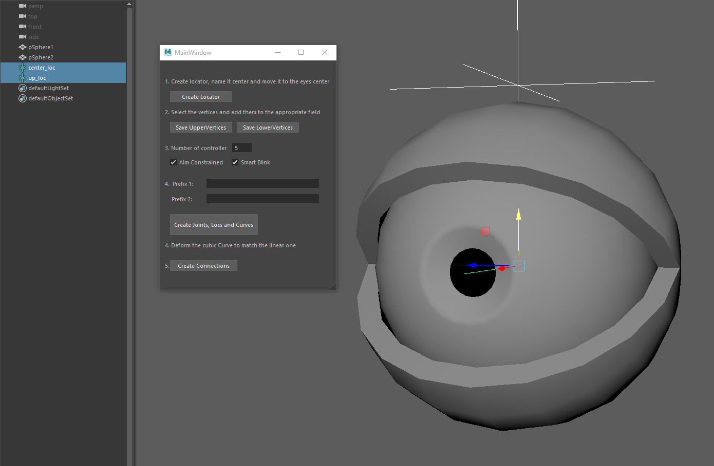

# Eye Rig Script

I really liked Marco Giordanos scripts and workflow for Cartoon Eyelids , so I extended their functionality to include more of the steps needed to achieve them.

Added Functions
<ul>
<li> saving the selected vertices </l>
<li> creating the objects with the right names and hierarchy structure </l>
<li> create curves at the vertex positions </l>
<li> creating the needed controllers and their constraints </l>
<li> creating the control joints and skinning them to the curves </l>
</ul>

[Marco Giordano Tutorials](https://www.youtube.com/watch?v=-rtys3vFmso&list=PLDBHtmY7-3uShaXYznC9Xi_bfQGj-K6eq)

# Manual for rigging an eye

A short demo can also be viewed [here](https://youtu.be/ZhpSQit_vho).

This should be what you see when you start the scipt. 

Start by pressing the "create Locator" button, and move both to the center of the Eye. Move the "up_loc" above the eye. 

Select the vertices you want as the positions of your joints later. You should include every single one from one corner to the other. After, press the "Save upper Vertices"

Same for the "Save Lower Vertices"

Think about the names you want to use and the amount of controllers you want. For rigging an Eye, both the Aim Constraint and the SmartBlink should be checked. Then, click on "Create Joints, Locs and Curves"

This should be what you are seeing now. 

Hide everything except both "...crv_grp" now. 

Select the cubic curves, right click "control vertex", and move the control vertices to match the linear curve. 

This should be the result. 

After, click on "Create Connections"

If you move around the controller now, you should be able to see the joints follow along the geometry of the eye. If you select the main controls, there should be also an attribute "smart blink", and for the upper one "smart blink height". This makes it possible to go into a blink regardless of the controller position. the height controls where the blink position of both upper and lower lid is. 

# Manual for rigging something else than an eye

If you want to rig the skin around the eye for example, you can follow the same steps as before, but dont create the locators and uncheck the aim constraint and SmartBlink. 
If you want to rig something like an eyebrow, select the vertices that follow the eyebrow shape, save them as "upper vertices" and only fill out the first prefix textfield. Also uncheck the SmartBlink and aim constraint checkboxes
